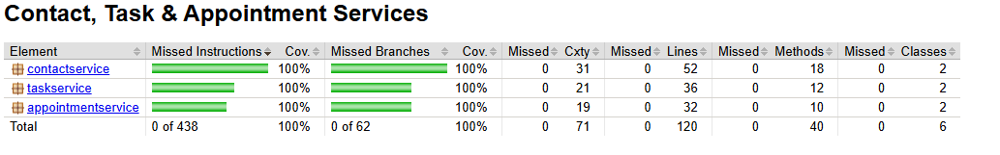

# Contact, Task & Appointment Services (Java + JUnit 5)

A Java backend with three in-memory service modules, built test-first for the Software Testing course at Southern New Hampshire University. Each service enforces strict input validation and is covered by a JUnit 5 test suite.

**46 unit tests · all passing · 100% line and branch coverage of application code** (measured with JaCoCo)

## Modules

| Module | Service operations | Validation rules |
| --- | --- | --- |
| `contactservice` | Add, delete, get, update first name / last name / phone / address | ID ≤ 10 chars and immutable; names ≤ 10 chars; phone must match `(XXX)XXX-XXXX`; address ≤ 30 chars; no nulls |
| `taskservice` | Add, delete, get, update name / description | ID ≤ 10 chars and immutable; name ≤ 20 chars; description ≤ 50 chars; no nulls |
| `appointmentservice` | Add, delete, get | ID ≤ 10 chars and immutable; date cannot be in the past; description ≤ 50 chars; no nulls |

Every service stores records in a `HashMap` keyed by ID, rejects duplicate IDs, and throws `IllegalArgumentException` for invalid input or missing records.

## Testing approach

- **Model tests** (`ContactTest`, `TaskTest`, `AppointmentTest`) check valid construction plus every rejection path: null fields, values one past each length limit, a malformed phone number, and a past date.
- **Service tests** (`*ServiceTest`) check add, get, update and delete, duplicate-ID rejection, deleting or reading a record that no longer exists, and that updates are re-validated.
- `@BeforeEach` builds a fresh service for every test, so tests are isolated and can run in any order.

## How to run

Requires Java 17 or newer. Maven does not need to be installed: the included Maven wrapper downloads it on first run.

```bash
git clone https://github.com/mkibler7/JUnitTestingProject.git
cd JUnitTestingProject
./mvnw test        # macOS / Linux
mvnw.cmd test      # Windows
```

The coverage report is written to `target/site/jacoco/index.html`.



## Project structure

```
src/
  main/java/{contactservice,taskservice,appointmentservice}/   service and model classes
  test/java/{contactservice,taskservice,appointmentservice}/   JUnit 5 tests
docs/                                                           course summary and reflection
```

## Tech stack

Java 17 · JUnit 5 · Maven (wrapper included) · JaCoCo

## Reflection

**How can I ensure that my code, program, or software is functional and secure?**
By writing thorough unit and integration tests, using static analysis tools, following secure coding practices, and keeping dependencies up to date.

**How do I interpret user needs and incorporate them into a program?**
By gathering requirements through interviews and user stories, prioritizing the features users need, and translating them into clear specifications and test cases.

**How do I approach designing software?**
I start from the user requirements, plan the system architecture (sometimes with UML diagrams), and keep modularity, scalability and maintainability in mind throughout.

## Contact

Created by **Michael Kibler**
[LinkedIn](https://www.linkedin.com/in/michael-kibler-11369519b/) | [Email](mailto:mpkibler7@gmail.com)
